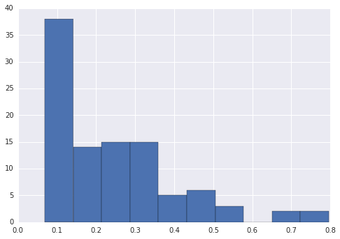
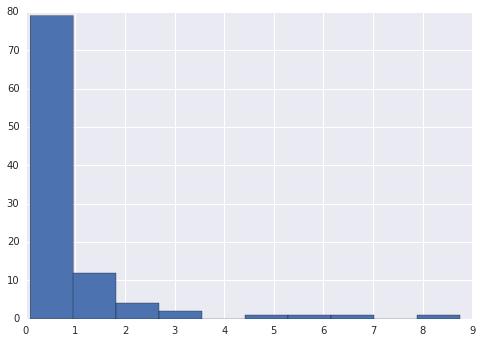
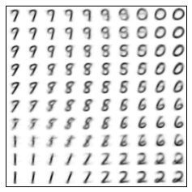
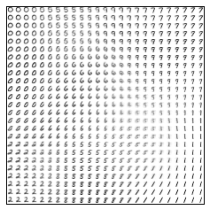

# EE5904R: NEURAL NETWORKS HW3
by Ryan Louie, A0149643X

## Q1 a)
The underlying function

```python
func = lambda x: 1.2*np.sin(np.pi*x) - np.cos(2.4*np.pi*x)
```
was to be predicted, by training on noisy observations of this function
```python
noisy_func = lambda x: func(x) + 0.3*np.random.randn()
```
The results for 100 trials are given below.

{width=400px}

The code to answer this question was written in `python`, using the `numpy` library for matrix and vector computations.

```python
import numpy as np

func = lambda x: 1.2*np.sin(np.pi*x) - np.cos(2.4*np.pi*x)
noisy_func = lambda x: func(x) + 0.3*np.random.randn()

trX = np.arange(-1,1,0.05)
teX = np.arange(-1,1,0.01)
trY = noisy_func(trX) # observed training data is noisy
teY = func(teX)       # actual test data is the real function
#TODO: plot y values
n_tr = trX.shape[0]
n_te = teX.shape[0]

rbf = lambda r, std: np.exp(-r**2 / (2.*std**2) )

class ExtactInterpolationRBFNetwork():
    """Exact Interpolation is the special case where

    interpM.shape = (N, N)
    where N is number of training examples

    and the centers of the RBF activations are the training data
    mu_j = x_train_j
    """
    def __init__(self, std=0.1):
        self.std = std

    def fit(self, trX, trY):

        n_tr = trY.shape[0]
        interpM = np.zeros((n_tr, n_tr), dtype='float32')
        for i in xrange(n_tr):
            for j in xrange(n_tr):
                interpM[i,j] = rbf(np.linalg.norm(trX[i] - trX[j]), self.std)
        # TODO: interp matrix should have diag of 1's
        # TODO: interp matrix should also have interesting vals outside of diagonals
        self.w = np.dot(trY,np.linalg.inv(interpM))
        self.mu = trX # mu is the training examples
        # TODO: w should be the same shape as trY
        # TODO: interpM * w should yield good accuracies
        assert self.w.shape == trY.shape

    def predict(self, teX):
        act = np.zeros((teX.shape[0], self.w.shape[0]), dtype='float32')
        # iterate over each test example to predict
        for i in range(teX.shape[0]):
            # process through the activation function for each hidden neuron
            for j in range(self.w.shape[0]):
                act[i,j] = rbf(np.linalg.norm(teX[i] - model.mu[j]), self.std)
        teXpred = np.dot(act, model.w)
        return teXpred


model = ExtactInterpolationRBFNetwork()
model.fit(trX, trY)
teXpred = model.predict(teX)
error = np.mean(np.abs(teXpred - teY))
```

## Q1 b)

{width=400px}

From part A, the mean error was 0.2614, while the mean error for part B is 0.9036. This Randomized Centers RBF Network used 15 Hidden RBF activation functions, as opposed to the 40 that the exact interpolation case used. While 40 hidden units intuitively means to me more expressive power, I think that more expressive power could be to the detriment of a model which may overfit on
the training data.  The higher error or poorer performance might be attributed to the fact that the 15 randomly selected centers may not have been a representative bunch. In addition, maybe the complexity of the function requires more hidden units to accurately model it.

A similar code structure was used to answer this question, with a class that was adapted for the Random Fixed Centers method:

```python
class RandomFixedCentersRBFNetwork(SpyderObject):
    """Random Fixed Centers is the case where

    interpM.shape = (N, H)
    where H is number of hidden nodes chosen as a parameter

    the centers of the RBF activations are H samples from the train data
    mu_j = x_train_j

    the standard deviations are defined by
    sigma_j = d_max / sqrt(2H)
    where d_max is maximum distance between chosen centers
    and H the number of hidden nodes
    """
    def __init__(self, n_hidden=15):
        super(RandomFixedCentersRBFNetwork, self).__init__()
        self.n_hidden = 15 # H parameter

    def fit(self, trX, trY):
        # select random centers from training data
        self.mu = trX[np.random.randint(0, trX.shape[0], self.n_hidden)]

        # precompute params
        if len(self.mu.shape) == 1: # 1D data cant be handled by pdist
            self.d_max = np.max(pdist(self.mu.reshape(-1, 1)))
        else: # 2D data can already be handled by pdist
            self.d_max = np.max(pdist(self.mu))
        self.std = self.d_max / ( np.sqrt(2.*self.n_hidden) )

        # construct interpolation matrix
        n_tr = trY.shape[0]
        interpM = np.zeros((n_tr, self.n_hidden), dtype='float32')
        for i in xrange(n_tr):
            for j in xrange(self.n_hidden):
                interpM[i,j] = rbf(np.linalg.norm(trX[i] - self.mu[j]), self.std)
        if n_tr == self.n_hidden: # interpM is square
            self.w = np.dot(trY,np.linalg.pinv(interpM).T)
        else: # we find the minimum using the same as linear least squares
            # TODO: sometimes interpM.T * interpM is singular, others not
            # FIXME: currently using pinv, not sure if its satisfactory
            self.w = np.dot(
                  np.dot(
                        np.linalg.pinv(np.dot(interpM.T, interpM))
                      , interpM.T)
                , trY)

    def predict(self, teX):
        act = np.zeros((teX.shape[0], self.w.shape[0]), dtype='float32')
        # iterate over each test example to predict
        for i in range(teX.shape[0]):
            # process through the activation function for each hidden neuron
            for j in range(self.w.shape[0]):
                act[i,j] = rbf(np.linalg.norm(teX[i] - self.mu[j]), self.std)
        teXpred = np.dot(act, self.w)
        return teXpred
```

## Q1 c)

----------------------------
  $\lambda$     average MAE
Regularization  over 100 Trials
--------------  ------------
         0.000  0.2380

         0.001  0.2120

         0.010  0.2283

         0.050  0.2512

         0.100  0.2464

         1.000  0.2209

         2.000  0.2420

         5.000  0.2937

        10.000  0.3646
----------------------------

Table: The Mean Absolute Error (MAE) for interpolating the function is given for various degrees of regularization.

Interestingly, the amount of regularization between the ranges of $\lambda = [0, 2]$ is negligible, while higher regularization is detrimental to the test performance.  For the interpolation of the given function, it seems like the most optimal value is near $\lambda = 0.001$

The `ExtactInterpolationRBFNetwork` code was modified to take in a regularization term $\lambda$ or `lam`. The calculation of the weight vector
depended on this `self.lam` parameter:

```python
self.w = np.dot(
      np.dot(
            np.linalg.pinv(np.dot(interpM.T, interpM) + self.lam*np.diag(np.ones(interpM.shape[1])))
          , interpM.T)
    , trY)
```

## Q2 preface)
## Q2 a)

{width=300px}

## Q2 b)

{width=300px}

## Q2 c)

{width=300px}

{width=300px}

{width=300px}

{width=300px}

{width=300px}

{width=300px}

## Q2 d)

{width=300px}

{width=300px}

{width=300px}

{width=300px}

{width=300px}

{width=300px}

## Q3 preface)
Since my student ID ends in `43`, I worked with the all the MNIST digits excluding `4` and `3`.
Instead of using the MNIST.mat file, I used the full MNIST dataset, with 60000 training examples and 10000 test examples. While my training process might have randomly selected a more diverse set of numbers, my model is more thoroughly evaluated on a larger test set.

## Q3 a)


## Q3 b)





## Q3 c)

The procedure of using the label of the closest neighbor as the predicted class for each node in the lattice was used. Each table below represents three trials, along average evaluation metric over the trials.

  Trial     Train Acc. Test Acc.
-------     ---------- ----------
      1     0.7509     0.7552
      2     0.7479     0.7476
      3     0.7810     0.7837
Average     0.7600     0.7622

Table: Accuracy metrics over multiple trials using the 10 x 10 Self Organizing Map

  Trial     Train Acc. Test Acc.
-------     ---------- ----------
      1     0.8345     0.8405
      2     0.8646     0.8695
      3     0.8523     0.8583
Average     0.8505     0.8561

Table: Accuracy metrics over multiple trials using the 25 x 25 Self Organizing Map

We notice that the larger the Self Organizing Map, the higher the predictive power.  This fits our intuition, since the weights associated with each node in the lattice are similar to hand-written digit "prototypes"; the more prototypes one has, the more nuanced of a representation we are storing. This nuance helps in the classification of the variations of written digits in the dataset.

## Q3 code)

The code was written in Python, the matrix operations were sped up using NumPy while plotting visualization was done with matplotlib:


```python
    import matplotlib.pyplot as plt
    import numpy as np
    import sys
    import time
    from load import mnist
    from scipy.spatial.distance import cdist
    from idash import IDash
    from sklearn.metrics import accuracy_score

    dash = IDash(framerate=0.01)

    def idx1D_to_idx2D(idx, shape):
        n_rows, n_cols = shape

        ith_row = idx / n_cols
        jth_col = idx % n_cols

        return (ith_row, jth_col)

    def time_varying_sigma(n, sigma_0, tau):
        sigma = sigma_0 * np.exp(-n / float(tau))
        return sigma

    def time_varying_neighborhood_function(d, n, sigma_0, tau):
        """
        d: distance from neighbor
        n: iteration. n=0 is the start of time
        """
        h = np.exp( -d**2 / (2.*time_varying_sigma(n, sigma_0, tau)**2) )
        return h

    def learningRate(n, lr_0, n_epochs_organizing_phase, lr_min=0.01):
        lr = lr_0 * np.exp( -n / float(n_epochs_organizing_phase) )

        if lr < lr_min:
            return lr_min
        else:
            return lr

    def init_neighborhood_size(map_shape):
        m, n = map_shape
        sigma_0 = np.sqrt(m**2 + n**2) / 2.
        return sigma_0

    def init_timeconstant(n_epochs_organizing_phase, sigma_0):
        return float(n_epochs_organizing_phase) / np.log(sigma_0)

    trX, teX, trY, teY = mnist(ntrain=60000, ntest=10000, onehot=False)
    xmin_val = trX[0].min()
    xmax_val = trX[0].max()

    if raw_input('remove_classes 3 and 4? (y/n)') == 'y':
        trY = np.column_stack((trY[:,:3], trY[:,5:]))
        teY = np.column_stack((teY[:,:3], teY[:,5:]))
        assert teY.shape[1] == 8
        assert trY.shape[1] == 8
        n_classes = 8
    else:
        assert teY.shape[1] == 10
        n_classes = 10

    map_shape = (10, 10)
    map_size = map_shape[0] * map_shape[1]
    w = np.random.uniform(xmin_val, xmax_val, (784, map_size))

    n_weight_plots = int(raw_input('How many random weights to track? (max of 16):'))
    random_weight_idxs = []
    if n_weight_plots > 0:
        for count in range(n_weight_plots):
            m = np.random.randint(0, w.shape[0])
            n = np.random.randint(0, w.shape[1])
            random_weight_idxs.append((m,n))

    n_epochs_organizing_phase = 1000;
    sigma_0 = init_neighborhood_size(map_shape)
    tau = init_timeconstant(n_epochs_organizing_phase, sigma_0)
    lr_0 = 0.1
    batch_size = 10

    # weight trajectories
    weight_history = np.zeros((n_weight_plots, n_epochs_organizing_phase))
    lr_history = np.zeros(n_epochs_organizing_phase)

    # precalculate neighbor distances
    neighbors = []
    for count in range(map_size):
        neighbors.append(idx1D_to_idx2D(count, map_shape))
    neighbors = np.vstack(neighbors)

    # precalculate distances between points
    map_distances_all_combos = cdist(neighbors, neighbors)

    # organizing phase
    verbose = False
    t0 = time.time()
    for epoch in range(n_epochs_organizing_phase):
        # MNIST
        for batch_i in range(batch_size):
            example_index = np.random.randint(0, trX.shape[0])
            sys.stdout.write("\rEpoch: %d | Examples Seen: %d" % (epoch, batch_size*epoch + batch_i))
            x = trX[example_index].reshape(1, -1)
            distances = cdist(x, w.T, 'euclidean')
            winner_idx = np.argmin(distances)

            # get map distances for this winner from cached distances
            map_distances = map_distances_all_combos[winner_idx]

            lr = learningRate(epoch, lr_0, n_epochs_organizing_phase)
            hs = np.array(
                    [time_varying_neighborhood_function(d, epoch, sigma_0, tau=tau)
                        for d in map_distances]
                 )

            # -- weight update
            w = w + lr*hs*(np.tile(x, (map_size,1)).T - w) # vectorized

            # track history
            for count, (m_row, n_col) in enumerate(random_weight_idxs):
                weight_history[count, epoch] = w[m_row, n_col]
            lr_history[epoch] = lr
            sys.stdout.flush()

    print "\n", time.time() - t0

    #SOM visualization of MNIST digits
    image_template = np.zeros((28,28))
    map_image = np.tile(image_template, map_shape)
    map_image_w = map_image.copy()
    lattice_predictions = np.zeros(map_size)
    for node_count in range(map_size):
        m_row, n_col = idx1D_to_idx2D(node_count, map_shape)
        closest_x_idx = np.argmin(cdist(w[:,node_count].reshape(1, -1), trX))
        image_of_closest_x = trX[closest_x_idx].reshape((28,28))
        lattice_predictions[node_count] = trY[closest_x_idx] # prediction mapping
        image_of_w = w[:,node_count].reshape((28,28))
        map_image[m_row*28:(m_row+1)*28, n_col*28:(n_col+1)*28] = image_of_closest_x
        map_image_w[m_row*28:(m_row+1)*28, n_col*28:(n_col+1)*28] = image_of_w

    dash.add(lambda: plt.imshow(map_image, cmap='gray'))
    dash.add(lambda: plt.imshow(map_image_w, cmap='gray'))

    # predictions
    def predict(X, w, lattice_predictions):
        n_examples = X.shape[0]
        Ypred = np.zeros(n_examples)
        for row in range(n_examples):
            closest_w_idx = np.argmin(cdist(X[row].reshape(1,-1), w.T))
            Ypred[row] = lattice_predictions[closest_w_idx]
        return Ypred
    trYpred = predict(trX, w, lattice_predictions)
    teYpred = predict(teX, w, lattice_predictions)

    # evaluate
    train_acc = accuracy_score(trY, trYpred)
    test_acc = accuracy_score(teY, teYpred)

    dash.plotframe()
```
