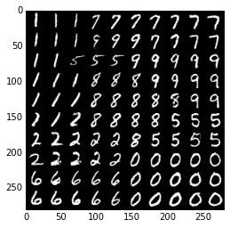
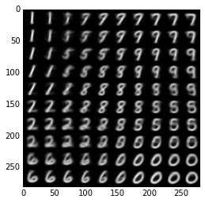

# EE5904R: NEURAL NETWORKS HW3
by Ryan Louie, A0149643X

## Q1 preface)

## Q1 a)
## Q1 b)

## Q2 preface)
## Q2 a)
## Q2 b)


## Q3 preface)
Since my student ID ends in `43`, I worked with the all the MNIST digits excluding `4` and `3`.
Instead of using the MNIST.mat file, I used the full MNIST dataset, with 60000 training examples and 10000 test examples. While my training process might have randomly selected a more diverse set of numbers, my model is more thoroughly evaluated on a larger test set.

## Q3 a)



## Q3 b)



## Q3 c)

The procedure of using the label of the closest neighbor as the predicted class for each node in the lattice was used. Each table below represents three trials, along average evaluation metric over the trials.

  Trial     Train Acc. Test Acc.
-------     ---------- ----------
      1     0.7509     0.7552
      2     0.7479     0.7476
      3     0.7810     0.7837
Average     0.7600     0.7622

Table: Accuracy metrics over multiple trials using the 10 x 10 Self Organizing Map

  Trial     Train Acc. Test Acc.
-------     ---------- ----------
      1     0.8345     0.8405
      2     0.8646     0.8695
      3     0.8523     0.8583
Average     0.8505     0.8561

Table: Accuracy metrics over multiple trials using the 25 x 25 Self Organizing Map

We notice that the larger the Self Organizing Map, the higher the predictive power.  This fits our intuition, since the weights associated with each node in the lattice are similar to hand-written digit "prototypes"; the more prototypes one has, the more nuanced of a representation we are storing. This nuance helps in the classification of the variations of written digits in the dataset.

## Q3 code)

The code was written in Python, the matrix operations were sped up using NumPy while plotting visualization was done with matplotlib:


```python
    import matplotlib.pyplot as plt
    import numpy as np
    import sys
    import time
    from load import mnist
    from scipy.spatial.distance import cdist
    from idash import IDash
    from sklearn.metrics import accuracy_score

    dash = IDash(framerate=0.01)

    def idx1D_to_idx2D(idx, shape):
        n_rows, n_cols = shape

        ith_row = idx / n_cols
        jth_col = idx % n_cols

        return (ith_row, jth_col)

    def time_varying_sigma(n, sigma_0, tau):
        sigma = sigma_0 * np.exp(-n / float(tau))
        return sigma

    def time_varying_neighborhood_function(d, n, sigma_0, tau):
        """
        d: distance from neighbor
        n: iteration. n=0 is the start of time
        """
        h = np.exp( -d**2 / (2.*time_varying_sigma(n, sigma_0, tau)**2) )
        return h

    def learningRate(n, lr_0, n_epochs_organizing_phase, lr_min=0.01):
        lr = lr_0 * np.exp( -n / float(n_epochs_organizing_phase) )

        if lr < lr_min:
            return lr_min
        else:
            return lr

    def init_neighborhood_size(map_shape):
        m, n = map_shape
        sigma_0 = np.sqrt(m**2 + n**2) / 2.
        return sigma_0

    def init_timeconstant(n_epochs_organizing_phase, sigma_0):
        return float(n_epochs_organizing_phase) / np.log(sigma_0)

    trX, teX, trY, teY = mnist(ntrain=60000, ntest=10000, onehot=False)
    xmin_val = trX[0].min()
    xmax_val = trX[0].max()

    if raw_input('remove_classes 3 and 4? (y/n)') == 'y':
        trY = np.column_stack((trY[:,:3], trY[:,5:]))
        teY = np.column_stack((teY[:,:3], teY[:,5:]))
        assert teY.shape[1] == 8
        assert trY.shape[1] == 8
        n_classes = 8
    else:
        assert teY.shape[1] == 10
        n_classes = 10

    map_shape = (10, 10)
    map_size = map_shape[0] * map_shape[1]
    w = np.random.uniform(xmin_val, xmax_val, (784, map_size))

    n_weight_plots = int(raw_input('How many random weights to track? (max of 16):'))
    random_weight_idxs = []
    if n_weight_plots > 0:
        for count in range(n_weight_plots):
            m = np.random.randint(0, w.shape[0])
            n = np.random.randint(0, w.shape[1])
            random_weight_idxs.append((m,n))

    n_epochs_organizing_phase = 1000;
    sigma_0 = init_neighborhood_size(map_shape)
    tau = init_timeconstant(n_epochs_organizing_phase, sigma_0)
    lr_0 = 0.1
    batch_size = 10

    # weight trajectories
    weight_history = np.zeros((n_weight_plots, n_epochs_organizing_phase))
    lr_history = np.zeros(n_epochs_organizing_phase)

    # precalculate neighbor distances
    neighbors = []
    for count in range(map_size):
        neighbors.append(idx1D_to_idx2D(count, map_shape))
    neighbors = np.vstack(neighbors)

    # precalculate distances between points
    map_distances_all_combos = cdist(neighbors, neighbors)

    # organizing phase
    verbose = False
    t0 = time.time()
    for epoch in range(n_epochs_organizing_phase):
        # MNIST
        for batch_i in range(batch_size):
            example_index = np.random.randint(0, trX.shape[0])
            sys.stdout.write("\rEpoch: %d | Examples Seen: %d" % (epoch, batch_size*epoch + batch_i))
            x = trX[example_index].reshape(1, -1)
            distances = cdist(x, w.T, 'euclidean')
            winner_idx = np.argmin(distances)

            # get map distances for this winner from cached distances
            map_distances = map_distances_all_combos[winner_idx]

            lr = learningRate(epoch, lr_0, n_epochs_organizing_phase)
            hs = np.array(
                    [time_varying_neighborhood_function(d, epoch, sigma_0, tau=tau)
                        for d in map_distances]
                 )

            # -- weight update
            w = w + lr*hs*(np.tile(x, (map_size,1)).T - w) # vectorized

            # track history
            for count, (m_row, n_col) in enumerate(random_weight_idxs):
                weight_history[count, epoch] = w[m_row, n_col]
            lr_history[epoch] = lr
            sys.stdout.flush()

    print "\n", time.time() - t0

    #SOM visualization of MNIST digits
    image_template = np.zeros((28,28))
    map_image = np.tile(image_template, map_shape)
    map_image_w = map_image.copy()
    lattice_predictions = np.zeros(map_size)
    for node_count in range(map_size):
        m_row, n_col = idx1D_to_idx2D(node_count, map_shape)
        closest_x_idx = np.argmin(cdist(w[:,node_count].reshape(1, -1), trX))
        image_of_closest_x = trX[closest_x_idx].reshape((28,28))
        lattice_predictions[node_count] = trY[closest_x_idx] # prediction mapping
        image_of_w = w[:,node_count].reshape((28,28))
        map_image[m_row*28:(m_row+1)*28, n_col*28:(n_col+1)*28] = image_of_closest_x
        map_image_w[m_row*28:(m_row+1)*28, n_col*28:(n_col+1)*28] = image_of_w

    dash.add(lambda: plt.imshow(map_image, cmap='gray'))
    dash.add(lambda: plt.imshow(map_image_w, cmap='gray'))

    # predictions
    def predict(X, w, lattice_predictions):
        n_examples = X.shape[0]
        Ypred = np.zeros(n_examples)
        for row in range(n_examples):
            closest_w_idx = np.argmin(cdist(X[row].reshape(1,-1), w.T))
            Ypred[row] = lattice_predictions[closest_w_idx]
        return Ypred
    trYpred = predict(trX, w, lattice_predictions)
    teYpred = predict(teX, w, lattice_predictions)

    # evaluate
    train_acc = accuracy_score(trY, trYpred)
    test_acc = accuracy_score(teY, teYpred)

    dash.plotframe()
```